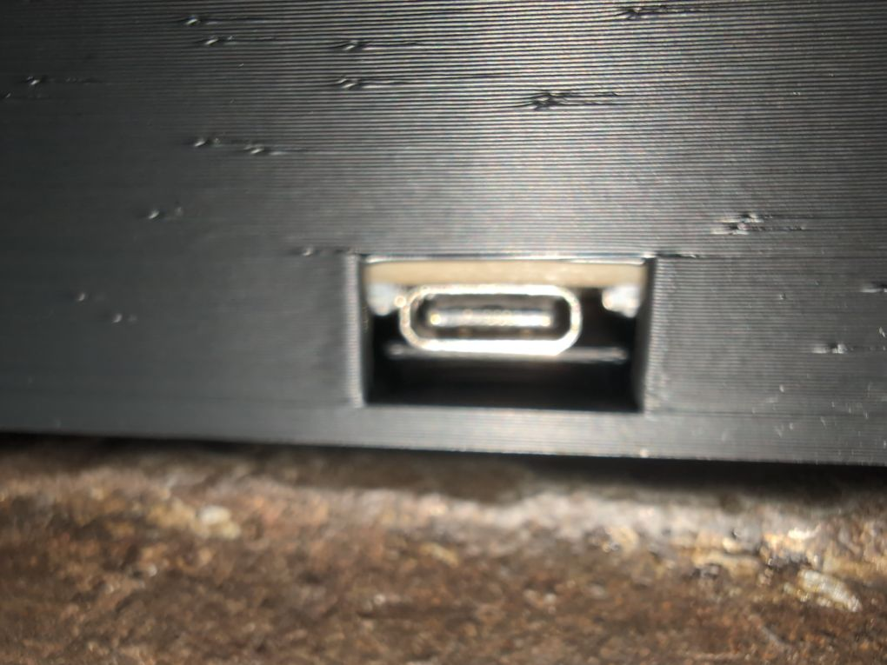

# SuperSensor 2.x Case

This is a 3D-printable case for the SuperSensor 2.x all-in-one voice, motion,
presence, temperature/humidity/air quality, and light sensor.

This case provides a convenient way to cover up the SuperSensor's PCB, either
for aesthetics or to help protect it from harsh environments.

You can [tinker the design on TinkerCAD here](https://www.tinkercad.com/things/1HT3fyNbln0-supersensor-case).
The case design and images in this folder are licensed under the Creative Commons
Attribution-ShareAlike (BY-SA) 4.0 license.

## Printing

Provided here are 5 `.obj` CAD files designed for slicing and printing with
any slicer software and 3D printer.

### `body.obj`

This is the main body of the case which houses the PCB. It includes an opening
for the insertion of a USB-C cable of "normal" size, which should fit most cables.

This part should be printed in a solid, durable material of any colour you wish.

### `face.obj`

This is the front face of the case. It clips into the body with 4 triangular
grip clips, and has 5 openings:
  * A large rectangle for the insert below.
  * A large circle for the PIR and am312 extension tube below.
  * A small flush hole for the TSL2591 light sensor.
  * A small funneled hole for the SGP41 air quality sensor.
  * A small funneled hole for the SHT45 temperature/humidity sensor.

**NOTE**: This design can affect the baseline readings of these sensors!
Specifically, the TSL will report much lower ambient light levels (up to 30 lux)
unless light is directly facing it; and the SHT45 will hover about 6 degrees
higher than the exposed PCB would from my testing. Take these into account in
your usage!

This part should be printed in a solid, durable material of any colour you wish.

### `insert.obj`

This insert fits into the large rectangle in the face, and provides a diffuser
for the feedback/status LEDs, including an opening for the INA microphone. It
is inserted into the face separately during assembly, though a multi-material
printer could concievably print it into the face during printing.

This part should be printed in a solid, durable material in **a natural or transluscent** colour (it must let light through).

### `am312-tube.obj`

This round tube provides additional buffering for the AM312 over the face, extending
it by 8mm to completely cover the AM312 body. It attaches to the face over the large
circular hol separately during assembly.

This part should be printed in a solid, durable material in any colour you wish.

### `usb-extension.obj` (optional)

This square tube provides additional coverage of the USB cable opening for situations
where that may be needed, either for "weatherproofing", cable management, or mounting.
It attaches over the opening in the body and should fit most cables. Note that USB
insertion may be harder with this on so consider that carefully during cable selection;
a long boot cable is a plus here.

This part should be printed in a solid, durable material in any colour you wish.

## Assembly

To begin, print the parts above as indicated; default slicer settings should be sufficient.
We will exclude the USB cable opening extension for this assembly, but its installation
is straightforward.

1. Lay out the parts; you will need:

    * The body, face, insert, and AM312 tube parts.
    * Superglue
    * A toothpick (if not using a precision superglue applicator)
    * A hard, flat surface (I use a vice)

   

2. Place the face face-down (clips up), and place dabs of superglue at the corners of the
   insert openings.

   

3. Spread the superglue along the inner edges with the toothpick; or, combine 2+3 by using
   a precision superglue applicator. You need very little glue here; avoid extra ooze!

   

4. Firmly place the insert face-down into the hole; the overlap edges should match.

   

5. Apply firm pressure to both sides of the insert with your thumbs, a vice, or another
   pressing object, until the glue can set up (15-30 seconds).

   

6. Flip over the face; the insert should now be solidly affixed. Clean up any oozing superglue
   with a paper towel or lint-free rag.

   

7. Place a small amount of superglue on your toothpick tip; if using a precision superglue
   applicator, skip this step.

   

8. Gently spread the superglue around the circular opening (or apply using a precision superglue
   applicator); you want the bead to be no more than 1mm wide to avoid ooze.

   

9. Line up the AM312 tube, and firmly press it down to seal. Clean up any oozing superglue
   with a paper towel or lint-free rag.

   

   You will now have a completed face assembly and are ready to install the actual SuperSensor.

   

10. Gently insert the SuperSensor board into the case body, lining it up with the four standoffs.
    The ESP32 should b firmly sitting on the bottom (it should require no force).

   

    You can verify that the USB plug is sitting flush on the base.

   

11. Remove the top cap of the AM312.

12. Place the face over the AM312.

   

13. Line up the clips on one side (I prefer the left). Then using a gentle squeezing motion, apply
    pressur eto the sides of the case on the right side while also applying lateral pressure on
    the face towards the inserted clips. This picture is a one-handed demonstration, applying a
    squeezing pressure between my thumb and middle finger and a downwards pressure with my index
    finger to provide force; using two hands is advised.

   

14. While doing the previous step, ensure that the 3 sensor holes are lined up with their corresponding sensors.

   

15. Press the face into the body so that all 4 clips are making contact.

   

16. Reinstall the top cap of the AM312; it should have a snug fit against the tube.

You now have an assembled case!

As a further step, consider placing a line of tape around the face-body joint. The locking clip
design was made with printing in mind, and does have some play here.
